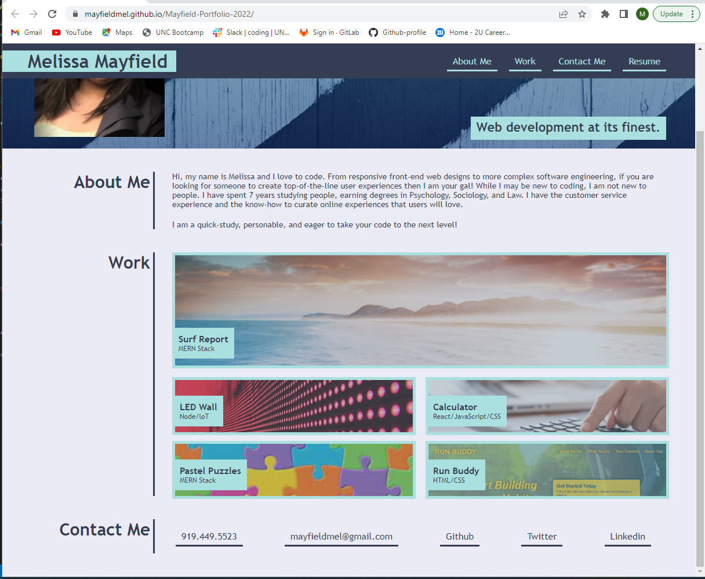

# Mayfield Portfolio 2022

 This repo houses the assets used to build my portfolio website, available at https://mayfieldmel.github.io/Mayfield-Portfolio-2022/ .

 

 ## My Portfolio

My portfolio offers a brief overview of who I am and what I can do. Explore the many projects I have developed at the UNC Coding Bootcamp and reach out to get to know me better.

## Tools

* The website is built and developed using Visual Studio Code (VS Code). 
* HTML was used to create the website's content.
* CSS styled and formated the page. 
* Github hosts the repository and published the website.

## Website content

The content for the website is in the "index.html" file on the repository's main branch.

## CSS

The CSS stylesheet for the site is stored in the "CSS" folder within the "assets" directory on the repository's main branch. 

## Images

The images used on the site are stored in the "images" folder within the "assets" directory on the repository's main branch.

## Contribution

Made with ❤️ by Melissa Mayfield